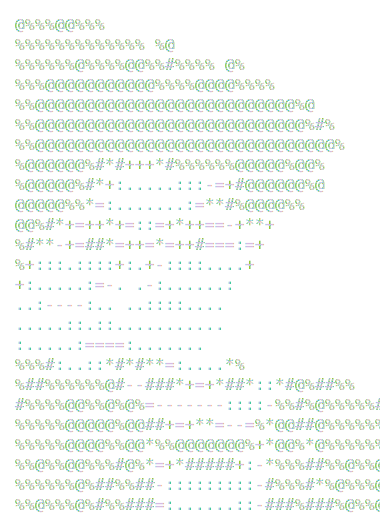

<!-- 
    Profile README inspired by Andrew6rant's
    You can check the original at: https://github.com/Andrew6rant/Andrew6rant
 -->

</style>

|

<a href="https://github.com/LucasKazuhiro/LucasKazuhiro">
<picture>   

</picture>
</a>

| Coluna 1 | Coluna 2 | Coluna 3 |
|----------|----------|----------|
| Dado 1   | Dado 2   | Dado 3   |
| Dado 4   | Dado 5   | Dado 6   |

<h2 align="left">Techs</h2>

  
  
  
  
  
  
  
  
  
  
  

<h2 align="left">Frameworks</h2>

  
  
  

<h2 align="left" >Tools</h2>

  
  
  
  
  
  
  
  
  

    

  
  

  

