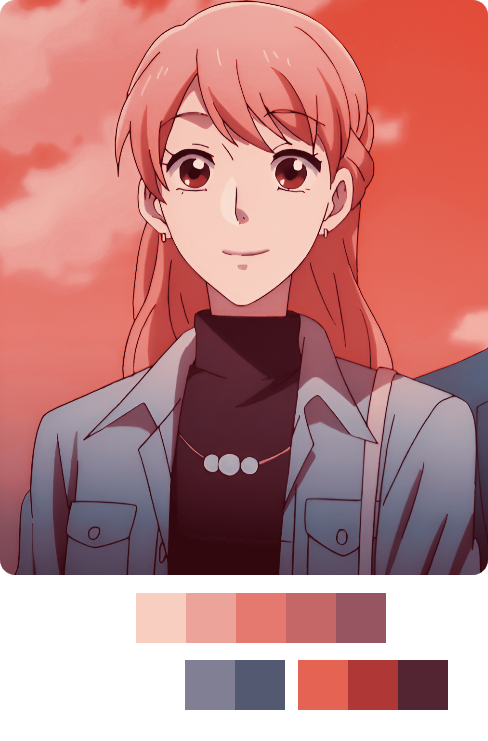

<!-- 
    Profile README inspired by: 
      > Andrew6rant         : https://github.com/Andrew6rant/Andrew6rant
      > pvhuwung            : https://github.com/pvhuwung/pvhuwung
      > TryKatChup          : https://github.com/TryKatChup/TryKatChup
      > AnOrdinaryUsername  : https://github.com/AnOrdinaryUsername
 -->


<a href="https://github.com/LucasKazuhiro/LucasKazuhiro">
<picture>   

</picture>
</a>

<br><br>

<div id="toc">
  <ul align="center" style="list-style: none">
    <summary>
      <h1>
        🤓 My Technical Skills
      </h1>
    </summary>
  </ul>
</div>

<table>
<tr>

<th> 
<div id="toc">
  <ul align="center" style="list-style: none">
    <summary>
      <h2>
        Techs
      </h2>
    </summary>
  </ul>
</div>
</th>

<th> 
<div id="toc">
  <ul align="center" style="list-style: none">
    <summary>
      <h2>
        Framewworks
      </h2>
    </summary>
  </ul>
</div>
</th>

<th> 
<div id="toc">
  <ul align="center" style="list-style: none">
    <summary>
      <h2>
        Tools
      </h2>
    </summary>
  </ul>
</div>
</th>
</tr>
<tr>
<td>
<div align="center">
<br>
<table>
<tr>
  <td></td>
  <td></td>
  <td></td>
  <td></td>
</tr>
<tr>
  <td></td>
  <td></td>
  <td></td>
  <td></td>
</tr>
</table>
</div>
</td>
<td>
<div align="center">
<br>
<table>
<tr>
  <td></td>
  <td></td>
  <td></td>
  <td></td>
</tr> 
</table>
<br>
</div>
</td>
<td>
<div align="center">
<br>
<table>
<tr>
  <td></td>
  <td></td>
  <td></td>
  <td></td>
</tr>
<tr>
  <td></td>
</tr>
</table>
</div>
</td>
</tr>
</table>

<a href="https://myanimelist.net/anime/35968/Wotaku_ni_Koi_wa_Muzukashii">

</a>


<br><br><br><br><br>

<div id="toc">
  <ul align="center" style="list-style: none">
    <summary>
      <h1>
        📁 Some of my Projects
      </h1>
    </summary>
  </ul>
</div>

<h2>🤖 Codes</h2>
<div align="center">
<a href="https://github.com/LucasKazuhiro/EarthWise-website">

</a>
<a href="https://github.com/LucasKazuhiro/loja-vinho">

</a>
</div>
<br>
<div align="center"> 
<a href="https://github.com/LucasKazuhiro/anime-statistics-charts">

</a>
<a href="https://github.com/LucasKazuhiro/filmes-statistics-charts">

</a>
</div>

<br>
<br>


<h2>✨ Design</h2>
<div align="left">
<a href="https://github.com/LucasKazuhiro/wine-store-dsgn">
  
</a>
</div>

<br><br><br><br><br>

<div id="toc">
  <ul align="center" style="list-style: none">
    <summary>
      <h1>
        🔥 Thanks for visiting
      </h1>
    </summary>
  </ul>
</div>
<div align="center">


</div>

<br>


<div align=center>

```redcode
Yokoso watashi no Soul Societyie
```

</div>