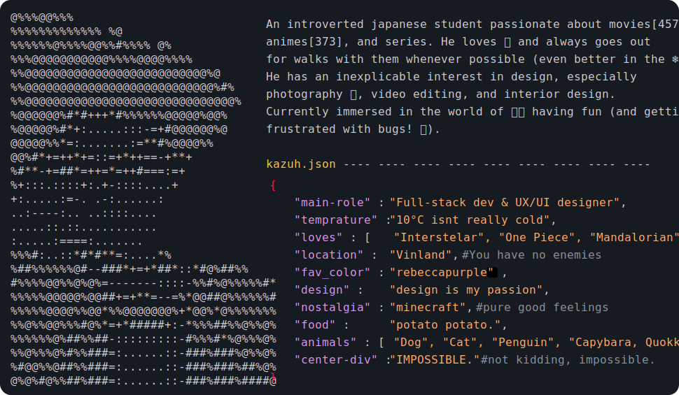
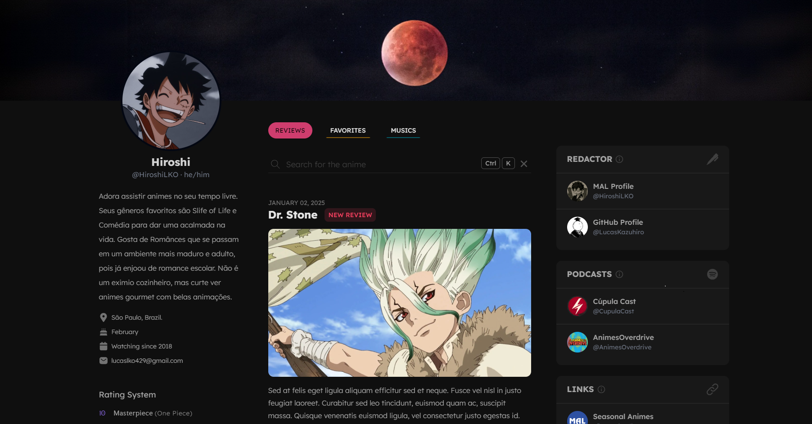
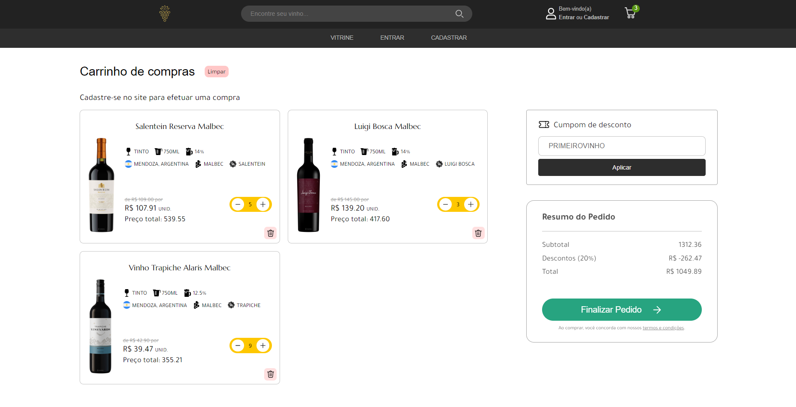
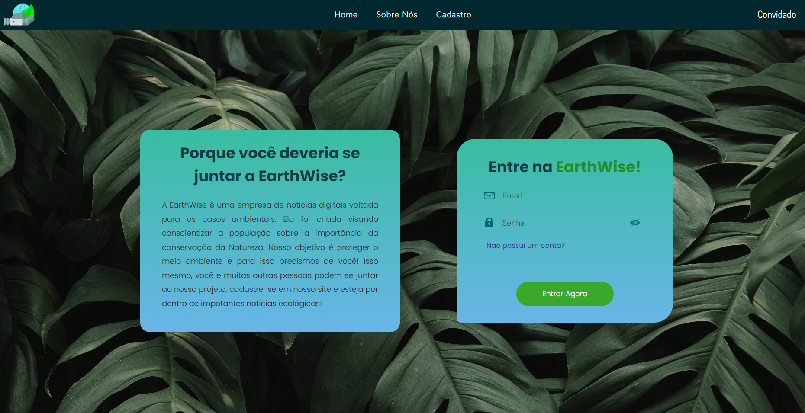
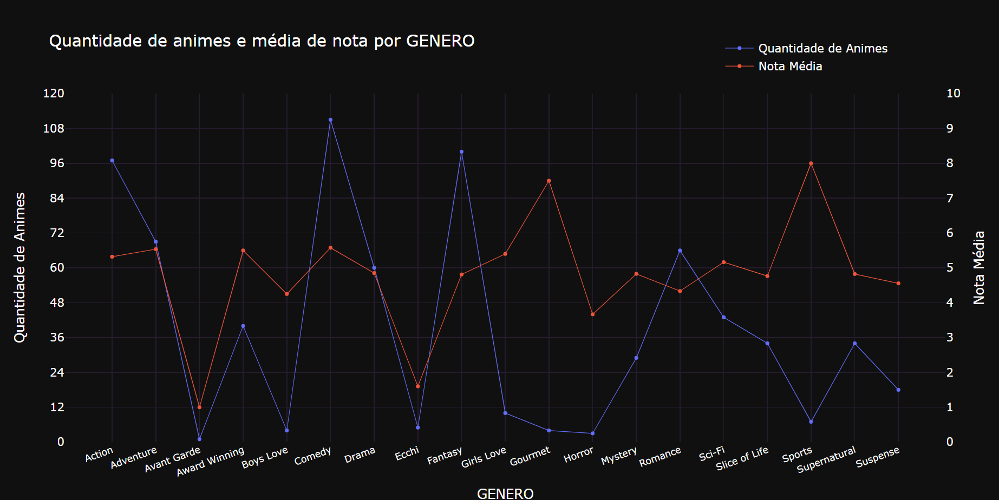
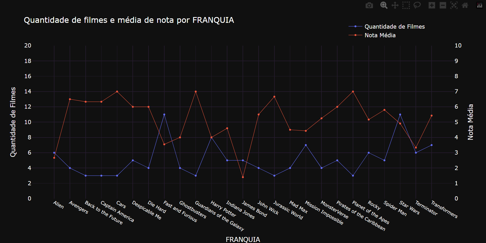
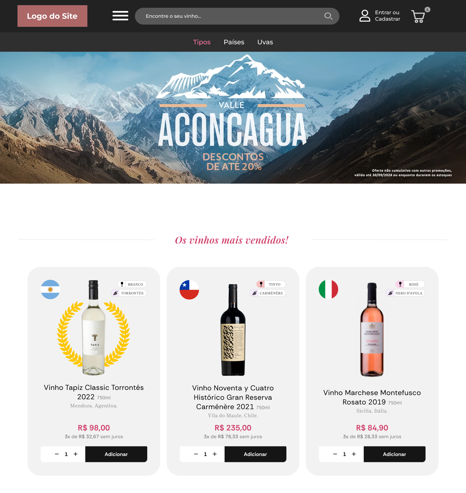
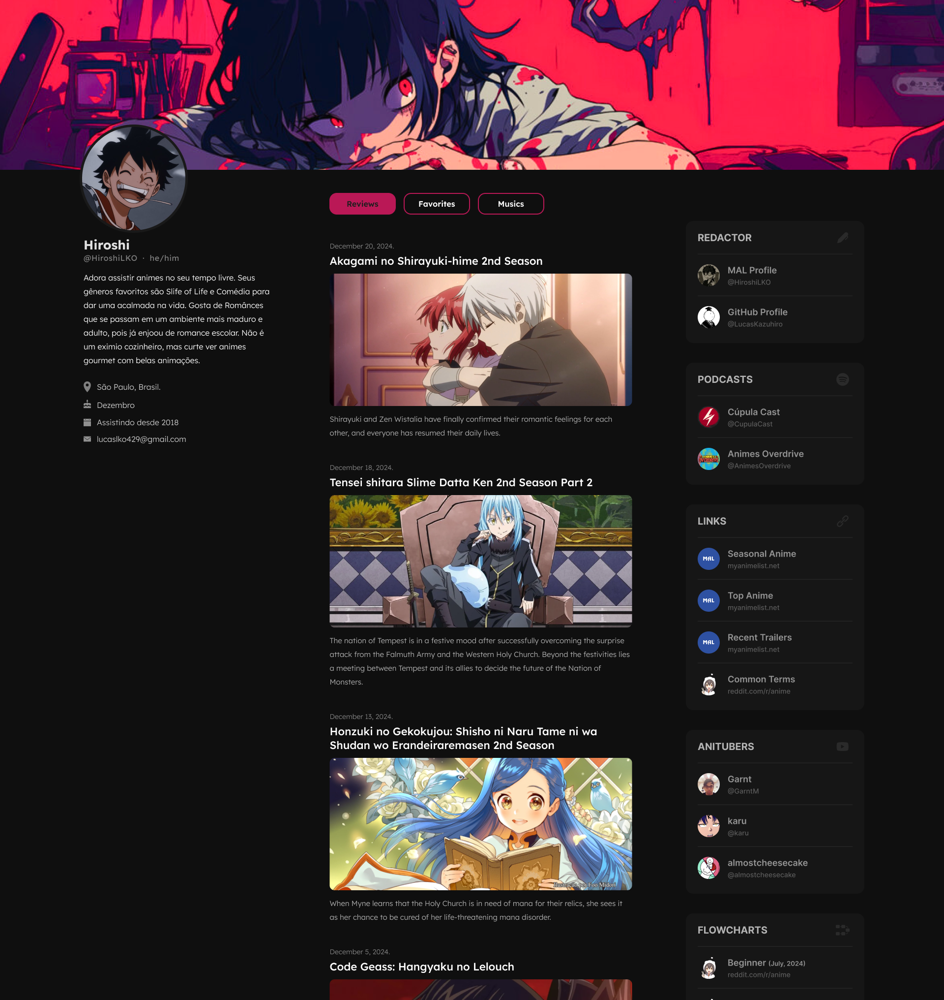

<!--
    Profile README inspired by:
      > Andrew6rant         : https://github.com/Andrew6rant/Andrew6rant
      > pvhuwung            : https://github.com/pvhuwung/pvhuwung
      > TryKatChup          : https://github.com/TryKatChup/TryKatChup
      > AnOrdinaryUsername  : https://github.com/AnOrdinaryUsername/AnOrdinaryUsername
      > ValentineFernandes  : https://github.com/ValentineFernandes/ValentineFernandes
      > thesanjithkumar     : https://github.com/thesanjithkumar/thesanjithkumar


    GitHub Workflows used:
      > athul               : https://github.com/athul/waka-readme
      > thanhhaudev         : https://github.com/thanhhaudev/github-stats
      > rahul-jha98         : https://github.com/rahul-jha98/github-stats-transparent
-->

<!-- Badges -->
<div align="left">
  
  
  <a href="https://korosenku.vercel.app/"></a>
  
  
  
  <a href="https://wakatime.com/@LucasKazuhiro"></a>
</div>

<!-- ASCII ART -->
<a href="https://github.com/LucasKazuhiro/LucasKazuhiro">
  <picture>
    
  </picture>
</a>

<!--  Music  ⸜(｡˃ ᵕ ˂ )⸝♡  -->
<div>
  
  <details align="left">
    <summary>🧡</summary>
    <br>
    <div align="center">
    <video src="https://github.com/user-attachments/assets/21da40dd-e63a-48a3-9bb3-a10f1cf3c995" controls muted="true"></video>
    </div>
  </details>
</div>

<br><br>

<!-- Section Title -->
<div id="toc">
  <ul align="center" style="list-style: none">
    <summary>
      <h1>
        🤓 My Technical Skills
      </h1>
    </summary>
  </ul>
</div>

<!-- Profile stats with TV & Dithering effect -->
<!--  -->

<!-- Table Icons -->
<table>
  <tr>
    <th width="200px">
      <div id="toc">
        <ul align="center" style="list-style: none">
          <summary>
            <h2>
              Techs
            </h2>
          </summary>
        </ul>
      </div>
    </th>
    <!-- Language icons -->
    <td width="650px">
      <a href="#"></a>
      <a href="#"></a>
      <a href="https://www.typescriptlang.org/"></a>
      <a href="#"></a>
      <a href="https://www.java.com/"></a>
      <a href="https://www.python.org/"></a>
      <a href="#"></a>
      <a href="https://www.php.net/"></a>
    </td>
  </tr>

  <tr>
    <th>
      <div id="toc">
        <ul align="center" style="list-style: none">
          <summary>
            <h2>
              Frameworks<br>Libs
            </h2>
          </summary>
        </ul>
      </div>
    </th>
    <!-- Frameworks & Libs icons -->
    <td>
      <a href="https://angular.dev/"></a>
      <a href="https://tailwindcss.com/"></a>
      <a href="https://spring.io/"></a>
      <a href="https://pandas.pydata.org/"></a>
      <a href="https://plotly.com/"></a>
      <a href="https://flask.palletsprojects.com/"></a>
    </td>
  </tr>

  <tr>
    <th>
      <div id="toc">
        <ul align="center" style="list-style: none">
          <summary>
            <h2>
              Tools
            </h2>
          </summary>
        </ul>
      </div>
    </th>
    <!-- Tools icons -->
    <td>
      <a href="https://code.visualstudio.com/"></a>
      <a href="https://www.jetbrains.com/pycharm/"></a>
      <a href="https://www.jetbrains.com/idea/"></a>
      <a href="https://www.figma.com/"></a>
      <a href="https://github.com/"></a>
      <a href="https://git-scm.com/"></a>
      <a href="https://www.mysql.com/"></a>
      <a href="https://vercel.com/"></a>
      <a href="https://www.postman.com/"></a>
      <a href="https://www.docker.com/"></a>
    </td>
  </tr>
</table>

<!-- Most used languages & Image -->
<div align="center">
  
  
  <p></p>
<div>

<br><br>

<!-- Section Title -->
<div id="toc">
  <ul align="center" style="list-style: none">
    <summary>
      <h1>
        💻 Programming Statistics
      </h1>
    </summary>
  </ul>
</div>

<div align="center">

<!--START_SECTION:commit-day-moment-->
**🕒 I'm An Early 🐤**

```text
🌅 Morning                308 commits         █████░░░░░░░░░░░░░░░░░░░░   18.19%
🌞 Daytime                629 commits         █████████░░░░░░░░░░░░░░░░   37.15%
🌆 Evening                353 commits         █████░░░░░░░░░░░░░░░░░░░░   20.85%
🌙 Night                  403 commits         ██████░░░░░░░░░░░░░░░░░░░   23.80%
```


<!--END_SECTION:commit-day-moment-->

<!--START_SECTION:langTime-->

```rust
From: 27 October 2024 - To: 26 January 2025

Total Time: 341 hrs 52 mins

TypeScript         117 hrs 25 mins ⣿⣿⣿⣿⣿⣿⣿⣿⣦⣀⣀⣀⣀⣀⣀⣀⣀⣀⣀⣀⣀⣀⣀⣀⣀   34.25 %
HTML               61 hrs 50 mins  ⣿⣿⣿⣿⣦⣀⣀⣀⣀⣀⣀⣀⣀⣀⣀⣀⣀⣀⣀⣀⣀⣀⣀⣀⣀   18.04 %
Java               38 hrs 48 mins  ⣿⣿⣷⣀⣀⣀⣀⣀⣀⣀⣀⣀⣀⣀⣀⣀⣀⣀⣀⣀⣀⣀⣀⣀⣀   11.32 %
CSS                36 hrs 33 mins  ⣿⣿⣶⣀⣀⣀⣀⣀⣀⣀⣀⣀⣀⣀⣀⣀⣀⣀⣀⣀⣀⣀⣀⣀⣀   10.67 %
Python             31 hrs 18 mins  ⣿⣿⣤⣀⣀⣀⣀⣀⣀⣀⣀⣀⣀⣀⣀⣀⣀⣀⣀⣀⣀⣀⣀⣀⣀   09.13 %
Markdown           12 hrs 54 mins  ⣿⣀⣀⣀⣀⣀⣀⣀⣀⣀⣀⣀⣀⣀⣀⣀⣀⣀⣀⣀⣀⣀⣀⣀⣀   03.76 %
JavaScript         5 hrs 27 mins   ⣤⣀⣀⣀⣀⣀⣀⣀⣀⣀⣀⣀⣀⣀⣀⣀⣀⣀⣀⣀⣀⣀⣀⣀⣀   01.59 %
```

<!--END_SECTION:langTime-->

<!--START_SECTION:commit-dayweek-->
<!--END_SECTION:commit-dayweek-->

<!--START_SECTION:editor-time-->
<!--END_SECTION:editor-time-->

<!-- Leetcode & Streak  -->
<div align="center">
  
  
</div>

</div>

<br><br><br>

<!-- Section title -->
<div id="toc">
  <ul align="center" style="list-style: none">
    <summary>
      <h1>
        📁 Some of my Projects
      </h1>
  </summary>
  </ul>
</div>

<!-- Projects warning text -->
<div align="center">
<p>
    <b><i>Click on the image</i></b> to access the project site (if available). To access the<br>
    <b><i>complete project</i></b>, click on the card (below the image) and <b><i>clone the repository</i></b>.
</p>
</div>

<!-- Projects subtitle (Codes) -->
<div id="toc">
  <ul align="left" style="list-style: none">
    <summary>
      <h2>🤖 Codes</h2>
  </summary>
  </ul>
</div>
<!-- First row -->
<table>
  <tr>
    <td width="50%">
      <a href="https://korosenku.vercel.app">
        
      </a>
      <a href="https://github.com/LucasOkokama/anime-blog-review">
        
      </a>
    </td>
    <td width="50%">
      <a href="https://github.com/LucasKazuhiro/loja-vinho">
        
      </a>
      <a href="https://github.com/LucasOkokama/loja-vinho">
        
      </a>
    </td>
  </tr>
</table>

<!-- Second row -->
<table>
  <tr>
    <td width="50%">
      <a href="https://lucasokokama.github.io/EarthWise-website-host/">
        
      </a>
      <a href="https://github.com/LucasOkokama/EarthWise-website">
        
      </a>
    </td>
    <td width="50%">
    </td>
  </tr>
</table>

<!-- Third row -->
<table>
  <tr>
    <td width="50%">
      <a href="https://github.com/LucasOkokama/anime-statistics-charts">
        
      </a>
      <a href="https://github.com/LucasOkokama/anime-statistics-charts">
        
      </a>
    </td>
    <td width="50%">
      <a href="https://github.com/LucasOkokama/filmes-statistics-charts">
        
      </a>
      <a href="https://github.com/LucasOkokama/filmes-statistics-charts">
        
      </a>
    </td>
  </tr>
</table>

<br>

<!-- Projects subtitle (Design) -->
<div id="toc">
  <ul align="left" style="list-style: none">
    <summary>
      <h2>✨ Design</h2>
    </summary>
  </ul>
</div>
<!-- First row -->
<table>
  <tr>
    <td width="50%">
      <a href="https://www.figma.com/proto/JKhN9qtK5zfoH0lPQIZcJ6/VinhoEcommerce">
        
      </a>
      <a href="https://github.com/LucasOkokama/wine-store-dsgn">
        
      </a>
    </td>
    <td width="50%">
      <a href="https://www.figma.com/proto/9xlVkFh4w7eP8Z3GWelY2q/Anime-Blog-Review?node-id=1-2&t=XBaEhW2ueDgbF9l7-1&scaling=scale-down-width&content-scaling=fixed&page-id=0%3A1">
        
      </a>
      <a href="https://github.com/LucasOkokama/anime-blog-review-dsgn">
        
      </a>
    </td>
  </tr>
</table>

<br>

<!-- Projects subtitle (Learnings) -->
<div id="toc">
  <ul align="left" style="list-style: none">
    <summary>
      <h2>🚀 Learnings (experimental stuff)</h2>
    </summary>
  </ul>
</div>
<!-- First row -->
<table>
  <tr>
    <td width="50%">
      <a href="https://github.com/LucasOkokama/Java_Console_Game">
        
      </a>
    </td>
    <td width="50%">
      <a href="https://github.com/LucasOkokama/simple-crud-springboot-postman">
        
      </a>
    </td>
  </tr>
</table>

<!-- Second row -->
<table>
  <tr>
    <td width="50%">
      <a href="https://github.com/LucasOkokama/vestibular-extrair-questoes">
        
      </a>
    </td>
    <td width="50%">
      <a href="https://github.com/LucasOkokama/study-simple-wishlist">
        
      </a>
    </td>
  </tr>
</table>

<br><br><br><br>

<!-- Section title -->
<div id="toc">
  <ul align="center" style="list-style: none">
    <summary>
      <h1>
        🔥 Thanks for visiting
      </h1>
    </summary>
  </ul>
</div>

<!-- Gif final page -->
<a href="https://myanimelist.net/anime/269/Bleach">
  
</a>

<!-- some random Gif's quote -->
<div align="center">

```diff
@@                                      Yokoso watashi no Soul Societyie                                     @@
##                                       ようこそ、私のソウルソサエティへ                                       ##
```

</div>
