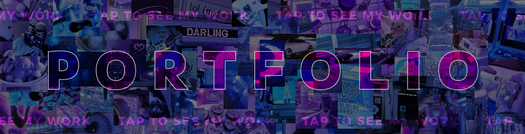
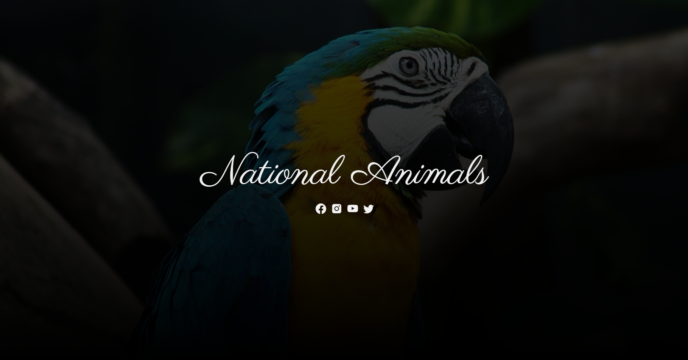

<!--
    Profile README inspired by:
      > Andrew6rant         : https://github.com/Andrew6rant/Andrew6rant
      > pvhuwung            : https://github.com/pvhuwung/pvhuwung
      > TryKatChup          : https://github.com/TryKatChup/TryKatChup
      > AnOrdinaryUsername  : https://github.com/AnOrdinaryUsername/AnOrdinaryUsername
      > ValentineFernandes  : https://github.com/ValentineFernandes/ValentineFernandes
      > thesanjithkumar     : https://github.com/thesanjithkumar/thesanjithkumar


    GitHub Workflows used:
      > athul               : https://github.com/athul/waka-readme
      > thanhhaudev         : https://github.com/thanhhaudev/github-stats
      > rahul-jha98         : https://github.com/rahul-jha98/github-stats-transparent
-->


<!-- Banner -->
<div align="center">
    <a href="https://lucasokokama.vercel.app/">
      
    </a>
</div>

<!-- ASCII ART -->
<a href="https://github.com/LucasKazuhiro/LucasKazuhiro">
  <picture>
    
  </picture>
</a>

<!--  Music  ⸜(｡˃ ᵕ ˂ )⸝♡  -->
<div>
  
  <details align="left">
    <summary>🧡</summary>
    <br>
    <div align="center">
    <video src="https://github.com/user-attachments/assets/21da40dd-e63a-48a3-9bb3-a10f1cf3c995" controls muted="true"></video>
    </div>
  </details>
</div>

<br><br>

<!-- Section Title -->
<div id="toc">
  <ul align="center" style="list-style: none">
    <summary>
      <h1>
        🤓 My Technical Skills
      </h1>
    </summary>
  </ul>
</div>


<!-- Table Icons -->
<table>
  <tr>
    <th width="200px">
      <div id="toc">
        <ul align="center" style="list-style: none">
          <summary>
            <h2>
              Techs
            </h2>
          </summary>
        </ul>
      </div>
    </th>
    <!-- Language icons -->
    <td width="650px">
      <a href="#"></a>
      <a href="#"></a>
      <a href="#"></a>
      <a href="https://www.typescriptlang.org/"></a>
      <a href="https://www.python.org/"></a>
      <a href="https://www.java.com/"></a>
      <a href="https://graphql.org/"></a>
    </td>
  </tr>

  <tr>
    <th>
      <div id="toc">
        <ul align="center" style="list-style: none">
          <summary>
            <h2>
              Frameworks
            </h2>
          </summary>
        </ul>
      </div>
    </th>
    <!-- Frameworks icons -->
    <td>
      <a href="https://angular.dev/"></a>
      <a href="https://nextjs.org/"></a>
      <a href="https://tailwindcss.com/"></a>
      <a href="https://getbootstrap.com/"></a>
      <a href="https://spring.io/"></a>
      <a href="https://expressjs.com/"></a>
    </td>
  </tr>

   <tr>
    <th>
      <div id="toc">
        <ul align="center" style="list-style: none">
          <summary>
            <h2>
              Libraries
            </h2>
          </summary>
        </ul>
      </div>
    </th>
    <!-- Libs icons -->
    <td>
      <a href="https://react.dev/"></a>
      <a href="https://styled-components.com/"></a>
      <a href="https://pandas.pydata.org/"></a>
      <a href="https://plotly.com/"></a>
      <a href="https://matplotlib.org/"></a>
    </td>
  </tr>

   <tr>
    <th>
      <div id="toc">
        <ul align="center" style="list-style: none">
          <summary>
            <h2>
              Database
            </h2>
          </summary>
        </ul>
      </div>
    </th>
    <!-- Database icons -->
    <td>
      <a href="https://www.mysql.com/"></a>
      <a href="https://www.postgresql.org/"></a>
    </td>
  </tr>

  <tr>
    <th>
      <div id="toc">
        <ul align="center" style="list-style: none">
          <summary>
            <h2>
              Unit & Integration
            </h2>
          </summary>
        </ul>
      </div>
    </th>
    <!-- Unit Testing icons -->
    <td>
      <a href="https://junit.org/"></a>
      <a href="https://vitest.dev/"></a>
      <a href="https://www.cypress.io/"></a>
      <a href="https://docs.pytest.org/"></a>
    </td>
  </tr>

  <tr>
    <th>
      <div id="toc">
        <ul align="center" style="list-style: none">
          <summary>
            <h2>
              Others
            </h2>
          </summary>
        </ul>
      </div>
    </th>
    <!-- Others icons -->
    <td>
      <a href="https://git-scm.com/"></a>
      <a href="https://sass-lang.com/"></a>
      <a href="https://vite.dev/"></a>
      <a href="https://nodejs.org/"></a>
    </td>
  </tr>

  <tr>
    <th>
      <div id="toc">
        <ul align="center" style="list-style: none">
          <summary>
            <h2>
              Tools
            </h2>
          </summary>
        </ul>
      </div>
    </th>
    <!-- Tools icons -->
    <td>
      <a href="https://code.visualstudio.com/"></a>
      <a href="https://www.jetbrains.com/pycharm/"></a>
      <a href="https://www.jetbrains.com/idea/"></a>
      <a href="https://www.figma.com/"></a>
      <a href="https://www.gimp.org/"></a>
      <a href="https://www.postman.com/"></a>
      <a href="https://github.com/"></a>
    </td>
  </tr>
</table>

<!-- Most used languages & Image -->
<div align="center">
  
  
  <p></p>
<div>

<br><br>

<!-- Section Title -->
<div id="toc">
  <ul align="center" style="list-style: none">
    <summary>
      <h1>
        💻 Programming Statistics
      </h1>
    </summary>
  </ul>
</div>

<div align="center">

<!--START_SECTION:commit-day-moment-->
**🕒 I'm An Early 🐤**

```text
🌅 Morning                276 commits         ███░░░░░░░░░░░░░░░░░░░░░░   13.93%
🌞 Daytime                742 commits         █████████░░░░░░░░░░░░░░░░   37.46%
🌆 Evening                494 commits         ██████░░░░░░░░░░░░░░░░░░░   24.94%
🌙 Night                  469 commits         ██████░░░░░░░░░░░░░░░░░░░   23.67%
```


<!--END_SECTION:commit-day-moment-->


<!--START_SECTION:langTime-->

```rust
From: 27 October 2024 - To: 29 December 2025

Total Time: 1,348 hrs 40 mins

TypeScript                 719 hrs 3 mins  ⣿⣿⣿⣿⣿⣿⣿⣿⣿⣿⣿⣿⣿⣤⣀⣀⣀⣀⣀⣀⣀⣀⣀⣀⣀   53.23 %
JavaScript                 133 hrs 57 mins ⣿⣿⣦⣀⣀⣀⣀⣀⣀⣀⣀⣀⣀⣀⣀⣀⣀⣀⣀⣀⣀⣀⣀⣀⣀   09.92 %
Java                       102 hrs 58 mins ⣿⣷⣀⣀⣀⣀⣀⣀⣀⣀⣀⣀⣀⣀⣀⣀⣀⣀⣀⣀⣀⣀⣀⣀⣀   07.62 %
CSS                        94 hrs 53 mins  ⣿⣷⣀⣀⣀⣀⣀⣀⣀⣀⣀⣀⣀⣀⣀⣀⣀⣀⣀⣀⣀⣀⣀⣀⣀   07.02 %
HTML                       76 hrs 17 mins  ⣿⣤⣀⣀⣀⣀⣀⣀⣀⣀⣀⣀⣀⣀⣀⣀⣀⣀⣀⣀⣀⣀⣀⣀⣀   05.65 %
Python                     52 hrs 26 mins  ⣿⣀⣀⣀⣀⣀⣀⣀⣀⣀⣀⣀⣀⣀⣀⣀⣀⣀⣀⣀⣀⣀⣀⣀⣀   03.88 %
C#                         24 hrs 31 mins  ⣦⣀⣀⣀⣀⣀⣀⣀⣀⣀⣀⣀⣀⣀⣀⣀⣀⣀⣀⣀⣀⣀⣀⣀⣀   01.81 %
Markdown                   15 hrs 30 mins  ⣤⣀⣀⣀⣀⣀⣀⣀⣀⣀⣀⣀⣀⣀⣀⣀⣀⣀⣀⣀⣀⣀⣀⣀⣀   01.15 %
```

<!--END_SECTION:langTime-->


<!--START_SECTION:commit-dayweek-->
<!--END_SECTION:commit-dayweek-->


<!--START_SECTION:editor-time-->
<!--END_SECTION:editor-time-->

</div>

<br><br><br>

<!-- Section title -->
<div id="toc">
  <ul align="center" style="list-style: none">
    <summary>
      <h1>
        📁 Some of my Projects
      </h1>
  </summary>
  </ul>
</div>

<!-- Projects warning text -->
<div align="center">
<p>
    <b><i>Click on the image</i></b> to visit the project's website (if available). If you want to explore<br>
    the complete project, <b><i>click on the card below the image</i></b> to access the repository and clone it.<br>
    Thank you for your interest in my work! Feel free to explore, contribute, or reach out with any feedback."
</p>
</div>

<!-- Projects subtitle (Codes) -->
<div id="toc">
  <ul align="left" style="list-style: none">
    <summary>
      <h2>🤖 Codes</h2>
  </summary>
  </ul>
</div>
<!-- First row -->
<table>
  <tr>
    <td width="50%">
      <a href="https://lucasokokama.vercel.app/">
        
      </a>
      <a href="https://github.com/LucasOkokama/portfolio-v1">
        
      </a>
    </td>
    <td width="50%">
      <a href="https://korosenku.vercel.app">
        
      </a>
      <a href="https://github.com/LucasOkokama/anime-blog-review">
        
      </a>
    </td>
  </tr>
</table>

<!-- Second row -->
<table>
  <tr>
    <td width="50%">
      <a href="https://github.com/LucasKazuhiro/loja-vinho">
        
      </a>
      <a href="https://github.com/LucasOkokama/loja-vinho">
        
      </a>
    </td>
    <td width="50%">
      <a href="https://wemage.vercel.app/">
        
      </a>
      <a href="https://github.com/LucasOkokama/pexels-image-search">
        
      </a>
    </td>
  </tr>
</table>

<!-- Third row -->
<table>
  <tr>
    <td width="50%">
      <a href="https://github.com/LucasOkokama/anime-statistics-charts">
        
      </a>
      <a href="https://github.com/LucasOkokama/anime-statistics-charts">
        
      </a>
    </td>
    <td width="50%">
      <a href="https://github.com/LucasOkokama/filmes-statistics-charts">
        
      </a>
      <a href="https://github.com/LucasOkokama/filmes-statistics-charts">
        
      </a>
    </td>
  </tr>
</table>

<!-- Fourth row -->
<table>
  <tr>
    <td width="50%">
      <a href="https://lucasokokama.github.io/EarthWise-website-host/">
        
      </a>
      <a href="https://github.com/LucasOkokama/EarthWise-website">
        
      </a>
    </td>
    <td width="50%">
      <a href="https://nationalanimals.vercel.app/">
        
      </a>
      <a href="https://github.com/LucasOkokama/animals-gallery">
        
      </a>
    </td>
</table>

<br>

<!-- Projects subtitle (Design) -->
<div id="toc">
  <ul align="left" style="list-style: none">
    <summary>
      <h2>✨ Design</h2>
    </summary>
  </ul>
</div>
<!-- First row -->
<table>
  <tr>
    <td width="50%">
      <a href="https://www.figma.com/proto/uGSOYUu6wNWY2nGpwLoBvn/Portfolio?node-id=1-2&p=f&t=hIAqQQhPsH0zjI49-0&scaling=min-zoom&content-scaling=fixed&page-id=0%3A1">
        
      </a>
      <a href="https://github.com/LucasOkokama/portfolio-v1-dsgn">
        
      </a>
    </td>
    <td width="50%">
      <a href="https://www.figma.com/proto/9xlVkFh4w7eP8Z3GWelY2q/Anime-Blog-Review?node-id=1-2&t=XBaEhW2ueDgbF9l7-1&scaling=scale-down-width&content-scaling=fixed&page-id=0%3A1">
        
      </a>
      <a href="https://github.com/LucasOkokama/anime-blog-review-dsgn">
        
      </a>
    </td>
  </tr>
</table>

<!-- Second row -->
<table>
  <tr>
    <td width="50%">
      <a href="https://www.figma.com/proto/JKhN9qtK5zfoH0lPQIZcJ6/VinhoEcommerce">
        
      </a>
      <a href="https://github.com/LucasOkokama/wine-store-dsgn">
        
      </a>
    </td>
     <td width="50%">
      <a href="https://www.figma.com/proto/4XOnKMPwSUb3F8eKU6V5j9/Unsplash-Image-Search?node-id=1-2&p=f&t=WyuvdZk1NbAvTCkh-0&scaling=scale-down-width&content-scaling=fixed&page-id=0%3A1">
        
      </a>
      <a href="https://github.com/LucasOkokama/pexels-image-search-dsgn">
        
      </a>
    </td>
  </tr>
</table>

<br>

<!-- Projects subtitle (Learnings) -->
<div id="toc">
  <ul align="left" style="list-style: none">
    <summary>
      <h2>🚀 Learnings (experimental stuff)</h2>
    </summary>
  </ul>
</div>

<!-- First row -->
<table>
  <tr>
    <td width="50%">
      <a href="https://github.com/LucasOkokama/api-rest-graphql">
          
      </a>
    </td>
    <td width="50%">
      <a href="https://github.com/LucasOkokama/unit-integration-test">
        
      </a>
    </td>
  </tr>
</table>

<!--
<br><br><br><br>
-->

<!-- Section title -->
<!--
<div id="toc">
  <ul align="center" style="list-style: none">
    <summary>
      <h1>
        🔥 Thanks for visiting
      </h1>
    </summary>
  </ul>
</div>
-->

<!-- Gif final page -->
<!--
<a href="https://myanimelist.net/anime/269/Bleach">
  
</a>
-->

<!-- some random Gif's quote -->
<!--
<div align="center">

```diff
@@                                      Yokoso watashi no Soul Societyie                                     @@
##                                       ようこそ、私のソウルソサエティへ                                       ##
```

</div>
-->
